# Core Concepts

This document explains the architectural principles and design decisions behind this OpenCode configuration.

## Architecture Overview

### Design Philosophy

This configuration is built on three core principles:

1. **Separation of Concerns** - Each agent has a specific, well-defined role
2. **Least Privilege** - Agents only have permissions needed for their function
3. **Progressive Complexity** - Start simple (direct handling) → escalate when needed (delegation)

### The Orchestration Pattern



The tech_lead acts as an intelligent router, deciding:
- Can I handle this directly?
- Do I need specialist help?
- Which agents are best suited?
- In what sequence should tasks execute?

### Agent Collaboration



All coordination flows through tech_lead, which delegates to specialized agents as needed. Each agent returns results to tech_lead, which synthesizes them for the user.

## Agent Roles

### tech_lead - The Orchestrator

**Purpose:** Primary user interface and task coordinator

**Key Capabilities:**
- Task decomposition and planning
- Subagent delegation via the `task` tool
- Direct markdown file editing
- High-level architectural discussions

**Permission Model:**
- Read-only access to code (except .env files → ask)
- Can edit/write markdown files only
- Can use bash commands (requires confirmation)
- Can delegate to all subagents

**Design Rationale:**
The tech_lead is intentionally limited in direct code modification. This forces proper delegation patterns and prevents the orchestrator from trying to do everything itself.

> **Source of Truth:** See `opencode/agent/tech_lead.md` for complete role definition

### explore - The Code Detective

**Purpose:** Search and understand codebase structure

**Key Capabilities:**
- File pattern matching (glob)
- Content searching (grep)
- Code navigation (LSP)
- Reading any file

**Permission Model:**
- Read-only access to everything
- Cannot modify anything
- Cannot delegate to other agents

**Design Rationale:**
Explore is a reconnaissance agent. It finds things and reports back. By prohibiting write access, we ensure it stays focused on search rather than attempting fixes.

> **Source of Truth:** See `opencode/agent/explore.md` for complete role definition

### librarian - The Research Specialist

**Purpose:** External knowledge retrieval

**Key Capabilities:**
- Web fetching and documentation lookup
- Context7 MCP integration for enhanced research
- Higher creativity (temperature 0.6) for synthesis

**Permission Model:**
- Web access only (webfetch)
- Context7 MCP tool access
- Cannot access codebase
- Cannot delegate to other agents

**Design Rationale:**
Librarian is isolated from the codebase to keep it focused on external research. This separation prevents confusion between "what our code does" and "what best practices suggest."

> **Source of Truth:** See `opencode/agent/librarian.md` for complete role definition

### junior_dev - The Implementation Specialist

**Purpose:** Code modification and file operations

**Key Capabilities:**
- Read, edit, and write any file
- Code navigation (LSP)
- Pattern matching for bulk changes
- Todo list management

**Permission Model:**
- Full read/write access to codebase
- Cannot execute bash commands
- Cannot delegate to other agents

**Design Rationale:**
junior_dev is the workhorse for code changes. It runs at lower temperature (0.15) for consistent, conservative edits. Bash access is prohibited to prevent accidental deployments or destructive operations.

> **Source of Truth:** See `opencode/agent/junior_dev.md` for complete role definition

### test_runner - The Verification Specialist

**Purpose:** Testing, building, and validation

**Key Capabilities:**
- Execute any bash command
- Read files and search code
- Run test suites and build processes

**Permission Model:**
- Full bash access for running tests/builds
- Read-only code access
- Cannot modify files
- Cannot delegate to other agents

**Design Rationale:**
test_runner is the only subagent with bash access. By separating execution from modification, we create a clear verification step. It runs at moderate temperature (0.3) to balance creativity in test interpretation with consistency.

> **Source of Truth:** See `opencode/agent/test_runner.md` for complete role definition

## Permission Architecture

### The Permission Model

Permissions are hierarchical and explicit:

```
deny by default
  ↓
allow specific tools
  ↓
restrict within tools (e.g., *.md only)
```

**Example from tech_lead:**
```json
{
  "*": "deny",           // Deny everything by default
  "read": {
    "*": "allow",        // Allow reading all files
    "*.env": "ask"       // Except .env → ask first
  }
}
```

### Why This Matters

1. **Safety** - Agents can't accidentally perform destructive operations
2. **Focus** - Limited tools = clearer role boundaries
3. **Predictability** - You know what each agent can/cannot do
4. **Audibility** - Permissions are explicit in `opencode/opencode.json`

> **Source of Truth:** See `opencode/opencode.json` for all agent permissions

## Delegation Mechanism

### How task Delegation Works

When tech_lead needs help, it uses the `task` tool:

1. **Load a skill template** - e.g., `explore-task`, `junior_dev-task`
2. **Populate template data** - Provide specific instructions
3. **Launch subagent** - OpenCode spawns the specialist
4. **Receive results** - Subagent returns findings in one message
5. **Synthesize** - tech_lead incorporates results into response

### Skill Templates

Skills are reusable delegation patterns stored in `opencode/skill/*/SKILL.md`:

- `explore-task` - How to ask explore to search
- `librarian-task` - How to request research
- `junior_dev-task` - How to assign implementation work
- `test_runner-task` - How to request testing/verification

Each skill defines:
- Required template data (what info the subagent needs)
- Expected output format (what it should return)
- Constraints and best practices

> **Source of Truth:** See `opencode/skill/` directory for all skill templates

### Why Skills Matter

Skills create a **contract** between tech_lead and subagents:
- tech_lead knows what info to provide
- Subagents know what's expected of them
- Results are consistent and predictable

## Model Selection

Different agents use different models based on their needs:

| Agent | Model | Temperature | Rationale |
|-------|-------|-------------|-----------|
| tech_lead | Claude Sonnet 4.5 | default | High reasoning for orchestration |
| explore | Claude Haiku 4.5 | default | Fast, efficient searching |
| librarian | Claude Sonnet 4.5 | 0.6 | Creative synthesis of research |
| junior_dev | Claude Haiku 4.5 | 0.15 | Conservative, consistent edits |
| test_runner | Claude Haiku 4.5 | 0.3 | Balanced test interpretation |

**Key Insight:** Not all tasks need the most powerful model. Haiku is faster and cheaper for focused tasks like searching and editing.

> **Source of Truth:** See `opencode/opencode.json` for model assignments

## When to Use Build Agent

The tech_lead delegation workflow is great for **targeted, multi-step tasks**. For **major refactors or full rebuilds**, the built-in `build` agent is better:

**Use tech_lead when:**
- Adding a feature to specific files
- Fixing bugs across a few modules
- Researching then implementing a pattern
- Iterative development with verification

**Use build agent when:**
- Complete project restructuring
- Migrating to a new framework
- Changing fundamental architecture
- Cross-cutting changes affecting many files

**Switching is seamless:** Press Tab → select build → conversation continues!

## Extensibility

This configuration is designed to grow:

### Adding New Agents

1. Create `opencode/agent/new_agent.md` with role definition
2. Add agent config to `opencode/opencode.json`
3. Define permissions based on the least privilege principle
4. Update tech_lead's delegation logic (if needed)

### Adding New Skills

1. Create `opencode/skill/new-task/SKILL.md` with template
2. Document required template_data fields
3. tech_lead can now use it via the `task` tool

### Adding Custom Tools

1. Create `opencode/plugins/new-tool.ts`
2. Assign permissions to agents that need it
3. Tool becomes available automatically

## Design Trade-offs

### Why Subagents Can't Delegate

**Decision:** Only tech_lead can use the `task` tool

**Rationale:** Prevents infinite delegation chains and keeps orchestration logic centralized

**Trade-off:** Subagents can't break down complex subtasks themselves

**Mitigation:** tech_lead should break tasks down before delegating

### Why junior_dev Has No Bash Access

**Decision:** junior_dev cannot execute shell commands

**Rationale:** Separation between modification and execution creates a verification checkpoint

**Trade-off:** Can't do "edit then immediately test" workflows within junior_dev

**Mitigation:** Use test_runner as the verification step after junior_dev completes

### Why Markdown Editing Is Direct

**Decision:** tech_lead can edit markdown directly without delegation

**Rationale:** Documentation updates are low-risk and benefit from tech_lead's context

**Trade-off:** Slight inconsistency in the "tech_lead only delegates" pattern

**Mitigation:** Markdown edits are clearly marked as an exception in tech_lead's role definition

## Summary

This configuration demonstrates:
- **Intelligent orchestration** through role-based delegation
- **Security through permissions** with least privilege
- **Flexibility through skills** for reusable delegation patterns
- **Efficiency through model selection** matching capability to need

The architecture is **simple enough to understand** but **sophisticated enough to handle real workflows**.

## Next Steps

- **[Usage Guide](GUIDE.md)** - See these concepts in action with examples
- **[Reference](REFERENCE.md)** - Quick lookup for agents and permissions
- **[Troubleshooting](TROUBLESHOOTING.md)** - Common issues and solutions

## Further Reading

- `opencode/agent/` - Complete agent role definitions
- `opencode/opencode.json` - Full configuration with permissions
- `opencode/skill/` - Delegation skill templates
