# Getting Started

This guide will help you start using the CodeAccelerate-OpencodeConfig and understand how tech_lead delegation works.

## Prerequisites

- OpenCode installed and configured
- Basic familiarity with OpenCode's agent system
- A project you want to work on

## First Steps

### 1. Activate This Configuration

In OpenCode:
1. Press Tab to switch agents/roles
2. Select `tech_lead` from the CodeAccelerate-OpencodeConfig
3. You're now talking to the orchestration agent!

### 2. Understanding tech_lead

The tech_lead agent is your primary interface. It:
- **Listens** to your requests and breaks them down
- **Delegates** subtasks to specialized agents when helpful
- **Synthesizes** results and presents them back to you
- **Handles** simple tasks directly when delegation isn't needed

Think of it as having an experienced tech lead on your team who knows when to assign work to specialists.

## Basic Concepts

### Delegation vs Direct Handling

**tech_lead delegates when:**
- Task requires multiple steps (find → modify → verify)
- Different expertise needed (code search vs implementation vs testing)
- Task is complex or time-consuming

**tech_lead handles directly when:**
- Simple markdown edits
- Quick questions or clarifications
- High-level planning or architectural discussions

### The Four Subagents

| Agent | Purpose | Example Use |
|-------|---------|-------------|
| **explore** | Find code patterns, locate files, understand structure | "Find all database migration files" |
| **librarian** | Fetch docs, research APIs, web searches | "Look up the latest FastAPI authentication patterns" |
| **junior_dev** | Implement changes, write code, modify files | "Update all instances of the old API format" |
| **test_runner** | Run tests, execute builds, verify functionality | "Run the test suite and check for failures" |

> **Note:** For the complete, up-to-date agent capabilities, see `opencode/agent/` directory.

## Your First Workflow

Let's try a realistic multi-step task:

### Example: Adding Error Handling

**Your request:**
```
Add error handling to all database query functions. 
Make sure they log errors properly and handle timeouts.
```

**What tech_lead does:**

1. **Uses explore** to find all database query functions
2. **Uses junior_dev** to add try-catch blocks and logging
3. **Uses test_runner** to verify nothing broke

**You see:**
- Progress updates as each step completes
- Summary of changes made
- Any issues encountered

### Example: Research Then Implement

**Your request:**
```
Research best practices for rate limiting in Express.js, 
then implement it in our API
```

**What tech_lead does:**

1. **Uses librarian** to research rate limiting patterns
2. **Uses explore** to find current API middleware
3. **Uses junior_dev** to implement rate limiting
4. **Uses test_runner** to verify it works

## When to Switch to Build Agent

If tech_lead suggests:
> "This task requires a full rebuild. Consider switching to the build agent using Tab."

It means the task is better suited for OpenCode's built-in `build` agent, which handles:
- Major refactors across many files
- Architectural changes
- Full project rebuilds
- Cross-cutting concerns

**To switch:** Just press Tab and select `build` - your conversation context carries over!

### Decision Flow



The diagram shows two paths:
- **Left path:** Use tech_lead's subagent delegation for quick fixes and targeted changes
- **Right path:** Switch to build agent for full rebuilds and major changes

The choice depends on task scope, not complexity.

## Common Patterns

### Pattern 1: Find and Fix

```
Find all TODO comments in the codebase and create GitHub issues for them
```

- explore finds TODOs
- junior_dev (or tech_lead directly) creates a summary or scripts

### Pattern 2: Research and Apply

```
Look up the latest React 19 features and update our component library to use them
```

- librarian researches React 19
- explore finds current components
- junior_dev updates implementations
- test_runner verifies compatibility

### Pattern 3: Verify and Report

```
Run all tests and create a summary of failures with potential causes
```

- test_runner executes test suite
- tech_lead synthesizes results into actionable report

## Tips for Effective Delegation

1. **Be specific about the goal** - "Add logging" vs "Add debug logging to all API endpoints"
2. **Trust the process** - Let tech_lead figure out the workflow
3. **Ask for clarification** - tech_lead will ask questions if your request is ambiguous
4. **Use markdown edits** - tech_lead can directly edit .md files without delegation

## What's Next?

- **[Core Concepts](CONCEPTS.md)** - Deep dive into architecture and design
- **[Usage Guide](GUIDE.md)** - More examples and advanced patterns
- **[Reference](REFERENCE.md)** - Quick lookup for configuration details
- **[Troubleshooting](TROUBLESHOOTING.md)** - Solutions to common issues

## Quick Reference

### Switching Agents/Roles
- Press **Tab** to open agent selector
- Select different role (tech_lead, build, etc.)
- Conversation context persists!

### Available Agents in This Config
- `tech_lead` - Primary orchestration agent (default)
- `explore` - Code search specialist (subagent)
- `librarian` - Documentation & research specialist (subagent)
- `junior_dev` - Code implementation specialist (subagent)
- `test_runner` - Testing & verification specialist (subagent)

### OpenCode Built-in Agents
- `build` - Full-stack implementation agent
- `plan` - (disabled in this config)
- `general` - (disabled in this config)

> **Remember:** The subagents are designed to be called by tech_lead, not used directly. Use tech_lead as your main interface!
